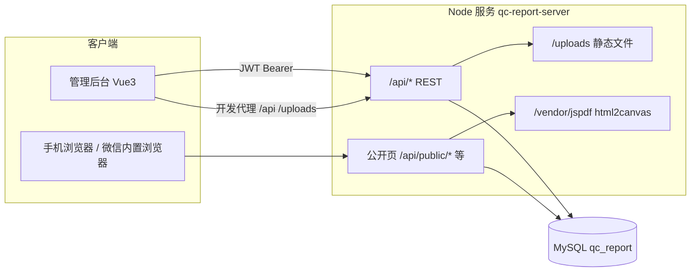

# 质检报告系统 — 技术文档

本文档描述本仓库内 **后端 API** 与 **管理后台** 的架构、技术栈、模块划分与运维要点。客户侧在根目录 `README.md` 中提及微信小程序目录 `miniprogram/`；当前仓库中未包含该目录，以下仅就现存代码说明。

---

## 1. 系统目标与边界

- **业务目标**：质检报告创建、维护、作废/激活、批量操作；二维码与客户扫码查看报告；公司章/骑缝章等印章资源；公司信息与模板配置；员工账号与按岗位（类别）的细粒度权限。
- **公开能力**：无登录用户通过扫码链接访问 **移动端友好落地页**，查看报告摘要（服务端拼接 HTML，含多语言标签等）；可选 PDF 导出（同域挂载 `jspdf` / `html2canvas` UMD，降低 CDN 被拦风险）。
- **管理端**：登录后的员工/超级管理员使用 SPA 完成日常操作；敏感菜单与 API 受 JWT + 权限矩阵保护。

---

## 2. 总体架构

- **运行时边界**：单进程 Express 应用监听 `PORT`（默认 `3001`），同时承担 JSON API、公开 HTML、上传文件静态服务及部分第三方库静态镜像。
- **管理端**：Vite 开发服务器（默认 `3000`）将 `/api`、`/uploads`、`/miniprogram` 代理到后端，生产环境通常为「静态资源 + 反代 API」部署。

---

## 3. 仓库结构与组件

| 路径 | 说明 |
|------|------|
| `server/` | Node.js（ESM）+ Express + MySQL2；业务与公开页逻辑 |
| `admin/` | Vue 3 + Vue Router（Hash）+ Pinia + Element Plus + Axios |
| `server/migrations/` | MySQL 增量脚本与安全/审计相关说明 |
| `README.md` | 简要运行说明 |
| `miniprogram/` | README 中计划的微信小程序（仓库当前无此目录） |

---

## 4. 技术栈明细

### 4.1 后端 (`server/package.json`)

- **运行时**：Node.js，`"type": "module"`
- **框架**：Express 4
- **数据库**：`mysql2/promise` 连接池（`server/src/db/pool.js`，`timezone: 'Z'`）
- **认证**：`jsonwebtoken`；载荷含 `accountType`、`permissions`（员工）等
- **校验**：`zod`
- **上传**：`multer`（上传目录与路由以实现对静态 `uploads` 的引用）
- **二维码**：`qrcode`
- **译文**：可对接 `LIBRETRANSLATE_URL`（`translate` 路由）
- **公开报告 PDF / 截图链路**：`puppeteer`；依赖包同域挂载 `jspdf`、`html2canvas` 以供公开页引用

### 4.2 管理端 (`admin/package.json`)

- **构建**：Vite 5 + `@vitejs/plugin-vue`
- **UI**：Element Plus + `@element-plus/icons-vue`
- **状态**：Pinia（如 `stores/auth.js`）
- **HTTP**：Axios 实例（`src/api/http.js`）：`baseURL` 来自 `VITE_APP_API_BASE_URL`，请求自动附带 `Authorization: Bearer <token>`，401 时清理令牌

---

## 5. 后端 API 与路由一览

入口：`server/src/index.js`，全局 `express.json({ limit: '5mb' })`、`cors()`。

| 挂载路径 | 路由文件 | 职责摘要 |
|----------|----------|----------|
| `/api/health` | `routes/health.js` | 健康检查 |
| `/api/auth` | `routes/auth.js` | 登录、令牌、密码策略相关 |
| `/api/reports` | `routes/reports.js` | 报告 CRUD、状态、批量、印章应用等 |
| `/api/qrcodes` | `routes/qrcodes.js` | 二维码与报告绑定 |
| `/api/stamps` | `routes/stamps.js` | 公司印章资源 |
| `/api/templates` | `routes/templates.js` | 报告模板与字段 |
| `/api/company` | `routes/company.js` | 公司设置 |
| `/api/employee-categories` | `routes/employeeCategories.js` | 员工类别及默认权限 |
| `/api/users` | `routes/users.js` | 用户管理 |
| `/api/translate` | `routes/translate.js` | 翻译代理（依赖环境开关与外部服务） |
| `/api/security` | `routes/securitySettings.js` | 系统安全策略（密码长度、登录锁定等） |
| `/api/audit` | `routes/auditLogs.js` | 登录/操作/错误日志查询 |
| `/`（及 `/api/public/*` 等） | `routes/public.js` | 扫码跳转、公开报告 HTML、兼容旧路径 |

根路径 `GET /` 返回纯文本标识 `qc-report-server`。未捕获异常经统一错误处理；5xx 时异步写入 `error_logs`（见 `lib/audit.js`）。

---

## 6. 认证与权限模型

### 6.1 账号类型

- **`super_admin`**：超级管理员；JWT 中 `permissions` 为 `null`，服务端与前端均视为全权限。
- **`employee`**：普通员工；有效权限 = 员工类别默认权限 JSON + 用户个人 `permissions_json` 覆盖合并（见 `effectiveEmployeePermissions`）。

历史迁移：`migrate_from_role_to_account_types.sql` 将旧 `role(admin/inspector)` 迁到 `account_type` + `employee_categories`。

### 6.2 JWT 中间件（`server/src/middleware/auth.js`）

- `requireAuth`：校验 Bearer Token，兼容旧 token 仅含 `role` 的情况并映射为 `accountType`。
- `requireSuperAdmin`：仅超级管理员。
- `requirePermission(module, key)` / `requireAnyPermission` / `requireAnyPermissionPairs`：对员工逐项校验。

### 6.3 权限模块（`server/src/lib/permissions.js`）

模块键：`reports`、`qrcodes`、`templates`、`stamps`、`company`。  
`reports` 下含 `list`、`view`、`create`、`edit`、`void`、`activate`、批量动作、`previewPrint`、`seals`、`fieldEdit`（按字段编辑）等。

### 6.4 前端路由守卫（`admin/src/router/index.js`）

- 无 token 非登录页 → 重定向 `/login`。
- `meta.superAdminOnly` → 非超管重定向 `/reports`。
- `meta.needPerm` / `meta.needAnyPerm` → 与 Pinia 中权限对象比对。

---

## 7. 数据存储（MySQL）

库名由环境变量 `MYSQL_DATABASE`（示例为 `qc_report`）指定。演进过程由 `server/migrations/` 下多份 **增量脚本** 描述，核心实体包括：

- **用户与组织**：`users`（含 `account_type`、`employee_category_id`、`permissions_json`、登录失败锁定字段等）、`employee_categories`
- **报告域**：报告主表及相关结构（脚本中含模板表 `report_templates`、`report_template_fields`，报告用印 `report_seals`，双语等见 `005`/`006` 增量说明）
- **二维码**：`qrcodes`（含 `token`；公开扫码根据 token 解析）
- **印章**：`company_stamps`（`seal_type`：`department_qc`、`inspector`、`supervisor`、`pass`、`recheck` 等）
- **公司与模板**：`company_settings`
- **安全与审计**（`002_security_audit.sql`）：`system_security_settings`、`login_logs`、`operation_logs`、`error_logs`

上线或升级应按 `README_UPGRADE_FROM_ROLE.md`、`README_SECURITY.md` 的说明顺序执行迁移并备份。

---

## 8. 公开扫码与客户页（`public.js`）

- **短链入口**：`/api/public/qr/:token`、`/qr/:token`、`/mp/qr/:token` → 302 到 `/api/public/scan?token=...`，避免手机实际访问域名与配置的 `PUBLIC_BASE_URL` 不一致导致外链失败。
- **落地页**：服务端生成 HTML，样式内联，适配竖屏与安全区；展示内容来自 `reportCustomerPayload` 等封装（公司信息、报告摘要、印章展示规则等）。
- **环境变量**：`PUBLIC_BASE_URL` 用于生成二维码内完整 URL 时须与手机可达地址一致；若反代仅转发 `/api/*`，需确保 **`/api` 路径** 可达。

---

## 9. 安全与审计

- **密码**：哈希存储；策略来自 `system_security_settings`（最短长度、常见弱口令黑名单等），见 `lib/securityPolicy.js`、`services/password.js`。
- **登录**：失败次数与锁定时间可配置；登录结果写入 `login_logs`。
- **操作审计**：关键操作写入 `operation_logs`（模块、动作、详情 JSON、IP、UA）。
- **错误日志**：服务端未处理异常 5xx 与保留天数策略（`errorLogRetentionDays`）；启动时 `purgeExpiredErrorLogs` 清理过期错误日志。

前端超级管理员可访问「安全设置」「审计」相关菜单（见路由配置）。

---

## 10. 环境与运行

### 10.1 后端（`server/.env.example`）

| 变量 | 含义 |
|------|------|
| `PORT` | HTTP 端口，默认 `3001` |
| `MYSQL_*` | 数据库连接 |
| `JWT_SECRET` | JWT 签名密钥 |
| `PUBLIC_BASE_URL` | 对外基础 URL（二维码、链接一致性） |
| `LIBRETRANSLATE_URL` / `LIBRETRANSLATE_ENABLED` | 可选翻译服务 |
| `ENABLE_API_DOCS` | 设为 `true` 时暴露 Swagger UI（`/api-docs`）与原始规范（`/openapi.yaml`），生产按需关闭 |

启动：`npm i` → 配置 `.env` → `npm run dev`（`node --watch`）或 `npm start`。

### 10.2 管理端（`admin/.env.example`）

- `VITE_APP_API_BASE_URL`：API 根；开发时与 Vite 代理目标一致即可。

启动：`npm i` → `npm run dev`（端口 3000）；生产：`npm run build`，将 `dist/` 置于静态服务器并由反向代理转发 `/api` 等到后端。

---

## 11. 部署注意

1. **一体或分离**：后端必须能访问 MySQL；静态资源可与 API 同源或跨域（需正确配置 CORS 与前端 `baseURL`）。
2. **上传目录**：`server/uploads`（或代码约定路径）需在磁盘持久化并在多实例部署时考虑共享存储。
3. **Puppeteer**：无头浏览器依赖 Chromium，Linux 服务器需安装相应系统依赖；容器内需额外镜像层支持。
4. **反代**：公开扫码路径可能不在 `/api` 前缀下（如 `/qr/:token`），负载均衡规则需放过这些路径。

---

## 12. 文档与代码索引

| 主题 | 位置 |
|------|------|
| 接口说明与变更记录（Markdown） | 根目录 [`API.md`](API.md) |
| OpenAPI 3.0 规范与类型定义 | [`docs/openapi.yaml`](docs/openapi.yaml)；挂载见 `server/src/setupApiDocs.js` |
| HTTP 入口与中间件 | `server/src/index.js` |
| JWT 与权限中间件 | `server/src/middleware/auth.js` |
| 权限常量与默认矩阵 | `server/src/lib/permissions.js` |
| 客户端 Axios 与拦截器 | `admin/src/api/http.js` |
| 页面与路由权限 | `admin/src/router/index.js` |
| 数据库迁移与说明 | `server/migrations/*.sql`、`README_*.md` |

---

*文档版本：与仓库当前代码同步整理；若增加 `miniprogram/` 或调整部署拓扑，请在本文件补充对应章节。*
