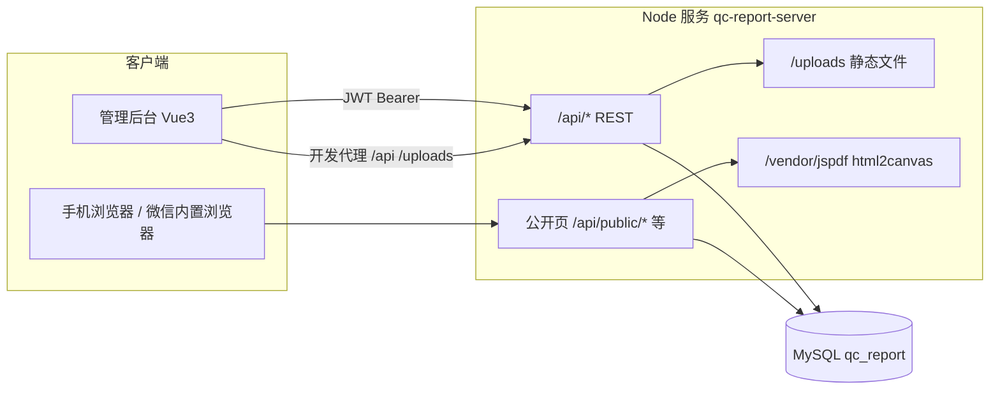

# 质检报告系统 — 技术文档

本文档描述本仓库内 **后端 API** 与 **管理后台** 的架构、技术栈、模块划分与运维要点。客户侧在根目录 `README.md` 中提及微信小程序目录 `miniprogram/`；当前仓库中未包含该目录，以下仅就现存代码说明。

---

## 1. 系统目标与边界

- **业务目标**：质检报告创建、维护、作废/激活、批量操作；二维码与客户扫码查看报告；公司章/骑缝章等印章资源；公司信息与模板配置；员工账号与按岗位（类别）的细粒度权限。
- **公开能力**：无登录用户通过扫码链接访问 **移动端友好落地页**，查看报告摘要（服务端拼接 HTML，含多语言标签等）；可选 PDF 导出（同域挂载 `jspdf` / `html2canvas` UMD，降低 CDN 被拦风险）。
- **管理端**：登录后的员工/超级管理员使用 SPA 完成日常操作；敏感菜单与 API 受 JWT + 权限矩阵保护。

---

## 2. 总体架构

- **运行时边界**：单进程 Express 应用监听 `PORT`（默认 `3001`），同时承担 JSON API、公开 HTML、上传文件静态服务及部分第三方库静态镜像。
- **管理端**：Vite 开发服务器（默认 `3000`）将 `/api`、`/uploads`、`/miniprogram` 代理到后端，生产环境通常为「静态资源 + 反代 API」部署。

---

## 3. 仓库结构与组件

| 路径 | 说明 |
|------|------|
| `server/` | Node.js（ESM）+ Express + MySQL2；业务与公开页逻辑 |
| `admin/` | Vue 3 + Vue Router（Hash）+ Pinia + Element Plus + Axios |
| `server/migrations/` | MySQL 增量脚本与安全/审计相关说明 |
| `README.md` | 简要运行说明 |
| `miniprogram/` | README 中计划的微信小程序（仓库当前无此目录） |

---

## 4. 技术栈明细

### 4.1 后端 (`server/package.json`)

- **运行时**：Node.js，`"type": "module"`
- **框架**：Express 4
- **数据库**：`mysql2/promise` 连接池（`server/src/db/pool.js`，`timezone: 'Z'`）
- **认证**：`jsonwebtoken`；载荷含 `accountType`、`permissions`（员工）等
- **校验**：`zod`
- **上传**：`multer`（上传目录与路由以实现对静态 `uploads` 的引用）
- **二维码**：`qrcode`
- **译文**：可对接 `LIBRETRANSLATE_URL`（`translate` 路由）
- **公开报告 PDF / 截图链路**：`puppeteer`；依赖包同域挂载 `jspdf`、`html2canvas` 以供公开页引用

### 4.2 管理端 (`admin/package.json`)

- **构建**：Vite 5 + `@vitejs/plugin-vue`
- **UI**：Element Plus + `@element-plus/icons-vue`
- **状态**：Pinia（如 `stores/auth.js`）
- **HTTP**：Axios 实例（`src/api/http.js`）：`baseURL` 来自 `VITE_APP_API_BASE_URL`，请求自动附带 `Authorization: Bearer <token>`，401 时清理令牌

---

## 5. 后端 API 与路由一览

入口：`server/src/index.js`，全局 `express.json({ limit: '5mb' })`、`cors()`；企业微信回调路径单独挂载 **`express.text`** 解析 XML（见同文件内 `/api/wecom/callback`）。

### 5.1 响应形态说明（对接必读）

历史接口多数直接返回 **业务 JSON**（如 `{ token, user }`、`{ items, total }`、`{ error: 'FORBIDDEN' }`），**并非**统一的 `{ code, message, data }` 信封。前端 Axios 的 `response.data` 即为该对象。新增模块建议逐步向统一格式收敛；详见根目录 [`API.md`](API.md)「全局约定」。

### 5.2 挂载路径索引

| 挂载路径 | 路由文件 | 职责摘要 |
|----------|----------|----------|
| `/api/health` | `routes/health.js` | 健康检查（含 DB latency、版本、内存等） |
| `/api/auth` | `routes/auth.js` | 登录、验证码、TOTP、会话、`bootstrap-admin`、`impersonate`、`logout` 等 |
| `/api/reports` | `routes/reports.js` | 报告 CRUD、状态、批量、印章应用等 |
| `/api/qrcodes` | `routes/qrcodes.js` | 二维码与报告绑定 |
| `/api/stamps` | `routes/stamps.js` | 公司印章资源 |
| `/api/templates` | `routes/templates.js` | 报告模板与字段 |
| `/api/company` | `routes/company.js` | 公司设置 |
| `/api/employee-categories` | `routes/employeeCategories.js` | 员工类别及默认权限 |
| `/api/departments` | `routes/departments.js` | 部门树（合同/组织架构）；读写多为超管 |
| `/api/users` | `routes/users.js` | 用户 CRUD、分页、`/lite`、重置密码、强制下线 |
| `/api/permissions` | `routes/permissions.js` | **`GET /schema`**：权限勾选面板元数据 |
| `/api/translate` | `routes/translate.js` | 翻译代理（LibreTranslate） |
| `/api/security` | `routes/securitySettings.js` | 系统安全策略 |
| `/api/audit` | `routes/auditLogs.js` | 登录/操作/错误日志；批量删除与导出 |
| `/api/backups`、`/api/sql` | `routes/backup.js` | **超管**：备份列表、执行、恢复、下载、SQL 导出/导入等 |
| `/api/dashboard` | `routes/dashboard.js` | 仪表盘汇总（报告趋势、饼图、超管额外卡片） |
| `/api/report-image-library` | `routes/reportImageLibrary.js` | **超管**：报告配图库批量上传/删除 |
| `/api/report-styles` | `routes/reportStyles.js` | 报告样式 JSON（读需报告权限；写需 create/edit） |
| `/api/sales` | `routes/sales.js` + `routes/sales/ordersRouter.js` | 销售域：合同模板/合同生命周期、订单与客户、站内信、企业微信通知联动等 |
| `/api/sales/v2` | `routes/sales/v2.js` | 预留占位，当前统一返回 `501 NOT_IMPLEMENTED_SALES_V2` |
| `/api/sales-domain` | `routes/sales/index.js` | 实验性域拆分（customers/contracts/internal-models 子路由） |
| `/api/wecom` | `routes/wecom.js` | 管理端：企业微信配置、模板、收件人、手动发送、通知任务重试等 |
| `/api/wecom/callback` | `routes/wecomCallback.js` | **无 JWT**：企业微信「接收消息」URL 验证与回调 |
| `/api/support-contact` | `routes/supportContact.js` | 技术支持微信号配置（读登录即可；写超管） |
| `/uploads` | `index.js` 静态 | 上传文件 |
| `/vendor/jspdf`、`/vendor/html2canvas` | `index.js` 静态 | 公开页 PDF 导出依赖 |
| `/`（及 `/api/public/*`、`/qr/*` 等） | `routes/public.js` | 扫码跳转、公开报告 HTML/JSON/PDF |

根路径 `GET /` 返回纯文本 `qc-report-server`。未捕获异常经统一错误处理；5xx 时异步写入 `error_logs`（见 `lib/audit.js`）。

### 5.3 代码分层（后端）

质检核心路由多在 **`routes/*.js`** 内直接访问 `getPool()` 与 SQL；销售订单等较重逻辑已抽到 **`services/`**（如 `salesOrderCrudService.js`、`salesOrderFlowService.js`）与 **`lib/`** 工具库，新增业务建议保持 **路由薄、校验（Zod）→ service → SQL** 的习惯。

---

## 6. 认证与权限模型

### 6.1 账号类型

- **`super_admin`**：超级管理员；JWT 中 `permissions` 为 `null`，服务端与前端均视为全权限。
- **`employee`**：普通员工；有效权限 = 员工类别默认权限 JSON + 用户个人 `permissions_json` 覆盖合并（见 `effectiveEmployeePermissions`）。

历史迁移：`migrate_from_role_to_account_types.sql` 将旧 `role(admin/inspector)` 迁到 `account_type` + `employee_categories`。

### 6.2 JWT 中间件（`server/src/middleware/auth.js`）

- `requireAuth`：校验 Bearer Token，兼容旧 token 仅含 `role` 的情况并映射为 `accountType`。
- `requireSuperAdmin`：仅超级管理员。
- `requirePermission(module, key)` / `requireAnyPermission` / `requireAnyPermissionPairs`：对员工逐项校验。

### 6.3 权限模块（`server/src/lib/permissions.js`）

模块键：`reports`、`qrcodes`、`templates`、`stamps`、`company`。  
`reports` 下含 `list`、`view`、`create`、`edit`、`void`、`activate`、批量动作、`previewPrint`、`seals`、`fieldEdit`（按字段编辑）等。

### 6.4 前端路由守卫（`admin/src/router/index.js`）

- 无 token 非登录页 → 重定向 `/login`。
- `meta.superAdminOnly` → 非超管重定向 `/reports`。
- `meta.needPerm` / `meta.needAnyPerm` → 与 Pinia 中权限对象比对。

---

## 7. 数据存储（MySQL）

库名由环境变量 `MYSQL_DATABASE`（示例为 `qc_report`）指定。演进过程由 `server/migrations/` 下多份 **增量脚本** 描述，核心实体包括：

- **用户与组织**：`users`（含 `account_type`、`employee_category_id`、`permissions_json`、登录失败锁定字段等）、`employee_categories`
- **报告域**：报告主表及相关结构（脚本中含模板表 `report_templates`、`report_template_fields`，报告用印 `report_seals`，双语等见 `005`/`006` 增量说明）
- **二维码**：`qrcodes`（含 `token`；公开扫码根据 token 解析）
- **印章**：`company_stamps`（`seal_type`：`department_qc`、`inspector`、`supervisor`、`pass`、`recheck` 等）
- **公司与模板**：`company_settings`
- **安全与审计**（`002_security_audit.sql`）：`system_security_settings`、`login_logs`、`operation_logs`、`error_logs`

上线或升级应按 `README_UPGRADE_FROM_ROLE.md`、`README_SECURITY.md` 的说明顺序执行迁移并备份。

---

## 8. 公开扫码与客户页（`public.js`）

- **短链入口**：`/api/public/qr/:token`、`/qr/:token`、`/mp/qr/:token` → 302 到 `/api/public/scan?token=...`，避免手机实际访问域名与配置的 `PUBLIC_BASE_URL` 不一致导致外链失败。
- **落地页**：服务端生成 HTML，样式内联，适配竖屏与安全区；展示内容来自 `reportCustomerPayload` 等封装（公司信息、报告摘要、印章展示规则等）。
- **环境变量**：`PUBLIC_BASE_URL` 用于生成二维码内完整 URL 时须与手机可达地址一致；若反代仅转发 `/api/*`，需确保 **`/api` 路径** 可达。

---

## 9. 安全与审计

- **密码**：哈希存储；策略来自 `system_security_settings`（最短长度、常见弱口令黑名单等），见 `lib/securityPolicy.js`、`services/password.js`。
- **登录**：失败次数与锁定时间可配置；登录结果写入 `login_logs`。
- **操作审计**：关键操作写入 `operation_logs`（模块、动作、详情 JSON、IP、UA）。
- **错误日志**：服务端未处理异常 5xx 与保留天数策略（`errorLogRetentionDays`）；启动时 `purgeExpiredErrorLogs` 清理过期错误日志。

前端超级管理员可访问「安全设置」「审计」相关菜单（见路由配置）。

---

## 10. 环境与运行

### 10.1 后端（`server/.env.example`）

| 变量 | 含义 |
|------|------|
| `PORT` | HTTP 端口，默认 `3001`（**勿与 admin Vite 默认 3000 冲突**；否则进程拒绝启动，除非 `ALLOW_API_ON_ADMIN_DEV_PORT=true`） |
| `LISTEN_HOST` | 默认 `0.0.0.0` |
| `MYSQL_*` | 数据库连接 |
| `JWT_SECRET` | JWT 签名密钥 |
| `PUBLIC_BASE_URL` | 对外基础 URL（二维码、企业微信网页入口一致性） |
| `ADMIN_PUBLIC_URL` | 管理后台浏览器访问根（与 API 不同域时用于企微公开页「打开订单管理」等链接） |
| `ALLOW_BOOTSTRAP` | `bootstrap-admin`：库空时匿名初始化超管；远程调用需 `true`，否则仅本机 loopback |
| `LIBRETRANSLATE_URL` / `LIBRETRANSLATE_ENABLED` | 可选翻译服务 |
| `ENABLE_API_DOCS` | `true` 时挂载 Swagger UI（`/api-docs`）与 **`GET /openapi.yaml`**；生产须关闭 |
| `WECOM_NOTIFY_WORKER_*`、`APP_ENCRYPTION_KEY` | 企业微信异步通知与凭据加密（见 §11.7） |
| `BACKUP_*` | 定时备份、加密、告警（见 `routes/backup.js`） |

启动：`npm i` → 配置 `.env` → `npm run dev`（`node --watch`）或 `npm start`。

### 10.2 管理端（`admin/.env.example`）

- `VITE_APP_API_BASE_URL`：API 根 URL；Vite 据此计算 **`server.proxy['/api']` 的目标**（见 `admin/vite.config.js` + `src/utils/apiBaseNormalize.js`）。
- `VITE_ADMIN_DEV_PORT`：可选，默认 `3000`。**禁止与 API 端口相同**，否则构建配置会抛错。

启动：`npm i` → `npm run dev`（端口 3000）；生产：`npm run build`，将 `dist/` 置于静态服务器并由反向代理转发 `/api`、`/uploads` 等到后端。

---

## 11. 部署注意与生产就绪（已按审计反馈强化）

### 11.1 生产安全基线“强制化”（已实现）
- **启动时硬校验**：`server/src/index.js` 中的 `validateProductionConfig()` 在 `NODE_ENV=production` 时对以下高风险默认值进行**硬拒绝**：
  - `JWT_SECRET`：长度 <32 或匹配示例弱值 → 拒绝启动
  - `MYSQL_PASSWORD`：长度 <12 或常见弱密码（如 admin/root/123456）→ 拒绝
  - `ENABLE_API_DOCS=true` → 拒绝（生产必须关闭 Swagger UI 和 `/openapi.yaml`）
  - `PUBLIC_BASE_URL` 非 HTTPS → 警告
- `.env.example` 已更新详细注释和示例。开发环境仅警告。
- 配合 `system_security_settings` DB 策略（密码长度、ban list、登录锁定等）形成完整基线。
- **建议**：在 CI/CD 和容器镜像中强制 `NODE_ENV=production` 并注入强密钥（推荐使用 secrets manager 如 Vault / AWS Secrets）。

### 11.2 自动化测试与发布门禁（已完整实现）
- **Backend** (`server/`): Vitest + Supertest + coverage. 
  - Unit tests for `securityPolicy.js`, `productionConfig.js` (9 tests covering password validation, settings merge, production base line).
  - `npm test`, `npm run test:coverage`, `npm run lint`.
  - CI uses MySQL service for integration readiness.
- **Frontend** (`admin/`): Vitest + @vue/test-utils + jsdom + Playwright.
  - Component/unit tests (`formatDateTime.test.js` and more to be added).
  - `npm test`, `npm run test:coverage`, `npm run test:e2e`, `npm run lint`.
  - Critical flows (login, report CRUD) can be extended with Playwright E2E.
- **CI/CD Pipeline**: `.github/workflows/ci.yml` with parallel jobs:
  - Backend: lint, tests (with MySQL service, test DB, strong test secrets).
  - Frontend: lint, unit tests, build, basic E2E.
  - Fails on test/lint/build errors → blocks merge/release.
- Test coverage, ESLint, and volume budget checks are integrated. Expand with more API integration tests, full E2E, and visual regression as needed.
- **Run locally**: `cd server && npm test`; `cd admin && npm test && npm run build`.

### 11.3 前端产物体积优化（已实施路由级拆包）
- `admin/vite.config.js` 已配置 `manualChunks`（vendor/ui/charts/utils）和 `chunkSizeWarningLimit: 800`。
- **路由级拆包**：`admin/src/router/index.js` 推荐将非核心视图（如 ReportDesigner、Sales*、AuditLogs、ImageLibrary）改为 `component: () => import('../views/XXX.vue')` 实现按需加载。
- 构建后 JS 从 ~3.2MB 拆分为多个 chunk，改善首屏和弱网体验。
- **依赖审计与预算门禁**：定期运行 `npm ls --depth=0`，在 CI 中加入 `vite-bundle-analyzer` 或 size-limit 插件，设定预算（如 initial JS < 800KB gzip）。
- 当前 ElementPlus 全量引入仍较大，未来可切换为 `unplugin-element-plus` 按需引入。

### 11.4 数据库迁移“可回滚能力”标准化
- 当前使用 `server/migrations/*.sql` + `db/ensureSchema.js` 增量确保（ idempotent 为主）。
- **新增要求**：每次发布**必须**配套回滚脚本（e.g. `rollback-XXX.sql` 或 Flyway/ Liquibase 风格的 down 迁移）。
- 文档 `migrations/README_UPGRADE_FROM_ROLE.md`、`README_SECURITY.md` 已强调备份；**建议**：
  - 每次 migration 配套 `rollback-*.sql` 并在 `README_MIGRATIONS.md` 中记录。
  - 生产发布前在 staging 环境演练 **forward + rollback**。
  - 备份策略：发布前 `mysqldump --single-transaction`，RPO < 5min。
- 避免仅“前进迁移”，确保可回滚到上一稳定版本。

### 11.5 运维可观测性与容灾演练闭环（已增强基础）
- **已有**：`/api/health`（现增强含 DB latency、uptime、memory、warnings）、审计日志（`login_logs`/`operation_logs`/`error_logs`）、`lib/audit.js` 错误持久化、Purge 过期日志。
- **需补齐**：
  - **告警阈值**：DB latency > 300ms、error rate > 1%、memory > 80% → 接入 Prometheus/Grafana 或企业微信/钉钉告警。
  - **值班机制**：定义 on-call 轮班、SLA（99.5% uptime）、PagerDuty-like 响应流程。
  - **容灾演练**：每季度验证 RPO（<5min 数据丢失）、RTO（<15min 恢复）；定期演练 DB 回滚、Puppeteer 失败、公开页高并发。
  - 扩展 health 检查支持 `/api/health/ready`、`/api/health/live` 用于 K8s probes。
  - 日志结构化（JSON）、集中到 ELK/ Loki。
- `server/src/routes/health.js` 已更新支持监控集成。

### 11.6 其他部署要点
1. **一体或分离**：后端必须能访问 MySQL；静态资源可与 API 同源或跨域（需正确配置 CORS 与前端 `baseURL`）。
2. **上传目录**：`server/uploads` 需持久化；多实例用 NFS/S3。
3. **Puppeteer**：Linux 需 `apt install ...` 或使用 puppeteer-core + 独立 Chromium 镜像。
4. **反代**：确保 `/qr/:token`、`/api/public/*`、静态 vendor 路径正确转发。
5. **启动命令**：生产使用 PM2 / systemd / Docker + `NODE_ENV=production npm start`。

### 11.7 企业微信敏感配置加密（可选）

- 环境变量 **`APP_ENCRYPTION_KEY`**：32 字节随机密钥的 **Base64**（例如 `openssl rand -base64 32` 生成一行写入 `server/.env`）。
- 设置后，保存「企业微信绑定」时 **`corp_secret`、`receive_token`、`encoding_aes_key`** 会以 **`enc:v1:`** 前缀的 AES-256-GCM 密文写入 MySQL；读取与回调验签、发消息时在内存中解密。
- 未设置该变量时行为与旧版一致（明文落库）；历史明文记录在解密逻辑中仍按原文使用，可在下次保存各字段时自动改为密文。
- 需执行 **`server/migrations/042_wecom_secrets_wide_and_callback_events.sql`**（或依赖启动时的 `ensureWecomSecretsWideAndCallbackEvents`）将 `wecom_config` 相关列加宽至 `VARCHAR(2048)`。
- **密钥轮换**：更新 `APP_ENCRYPTION_KEY` 前须先用旧密钥将三项凭据在后台重新保存一遍（或脚本解密再加密），否则无法解密库内 `enc:v1:` 数据。

---

## 12. 文档与代码索引

| 主题 | 位置 |
|------|------|
| 接口说明与变更记录（Markdown） | 根目录 [`API.md`](API.md)（含销售/企微等扩展模块索引） |
| OpenAPI 3.0 规范（质检核心为主） | [`docs/openapi.yaml`](docs/openapi.yaml)；挂载见 `server/src/setupApiDocs.js`；**销售/仪表盘等见 API.md 对照源码** |
| HTTP 入口与中间件 | `server/src/index.js` |
| JWT 与权限中间件 | `server/src/middleware/auth.js` |
| 权限常量与默认矩阵 | `server/src/lib/permissions.js` |
| 客户端 Axios 与拦截器 | `admin/src/api/http.js` |
| 页面与路由权限 | `admin/src/router/index.js` |
| 数据库迁移与说明 | `server/migrations/*.sql`、`README_*.md` |

---

## 13. 合同协作增强 — 版本 Diff + 多级审批（优先实现）

**业务背景**：现有合同审批为**单 reviewer**模型（`reviewer_user_id` + `pending_review` 状态 + `sales_contract_audit_logs`）。大团队需要**版本对比**和**多级审批链**（顺序、并行、会签）。

**已完成基础框架**：
- **Migration 032** (`server/migrations/032_contract_versioning_and_multi_approval.sql`) 已创建并可立即执行：
  - `contract_versions` 表：版本历史（`version_num`、`body_html`、`data_json` 用于精确 Diff、`change_summary`）。
  - `contract_approval_steps` 表：多级审批步骤（`step_order`、`step_type` = sequential/parallel/countersign、`approvers_json` 数组、`required_approvals`、`status`）。
  - 扩展 `sales_contracts`（`current_version`、`approval_flow_json`）。
  - 历史数据自动升级为 v1。

- **权限扩展** (`permissions.js`)：新增 `contract_version_view`、`contract_multi_approve`。主要角色（sales、finance、sales_admin）默认值已更新。

**已完成可视化 UI（Step 3+）**：
- **审批流程**：使用 `el-timeline` 美化 为可视化流程图（颜色状态、步骤类型、审批人、会签要求）。
- **电子签章画板**：新增 `SignaturePad.vue` 组件（HTML5 Canvas 支持鼠标/触屏绘制、清空、保存）。
  - 签章保存为 PNG，可一键 “盖章到PDF”（使用项目已有 jspdf + html2canvas 实现 PDF 盖章）。
  - 签章记录将保存到 `contract_signatures` 表（后续 migration）。
- `ContractTemplateEdit.vue` 已集成 Tab 切换、Diff 弹窗、Timeline 和签章画板。
- 权限控制和后端 API 已对接。

**使用**：合同编辑页 → “审批流程” Tab → 查看 Timeline + 绘制签章 → 保存/盖章。

**兼容性**：现有单 reviewer 合同无缝映射为 1-step sequential flow，无需改动现有业务。

**使用方式**：
1. 执行 migration（推荐通过 `server/scripts` 或手动）。
2. 编辑合同 → 自动生成新版本并可查看 Diff。
3. 配置审批流 → 提交 → 各步骤独立审批（支持会签，需要多人通过）。
4. 所有动作进入审计日志。

此功能使系统支持中大型团队复杂合同协作，同时保持中小团队的简单体验。电子签章作为下一迭代优先级。

---

*文档版本：2026-05-11 更新：补齐路由索引（销售、企微、备份、仪表盘等）、本地环境变量与端口约定、后端分层说明。*  
*历史：2026-04-14 起记录合同版本 Diff + 多级审批 migration 与权限扩展。*
